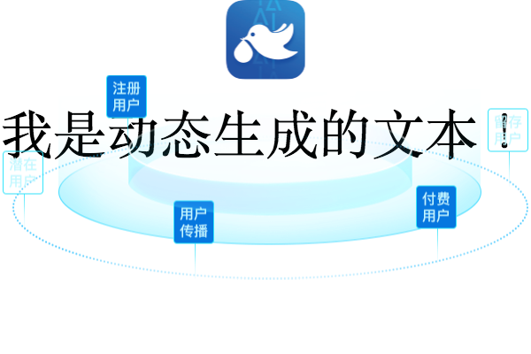

## JSX2Canvas

sytax sugar of canvas to help you build canvas easily.

if you're famliar with jsx, you can handle it quickly.

### demo

```jsx
import { Canvas, CImage, CText, jsx2canvas } from "@duiba/jsx2canvas";

function getCTX() {
  const c = document.getElementById("canvas");
  return c.getContext("2d");
}

function render(commands) {
  const ctx = getCTX();

  commands.map(command => {
    return command.run(ctx);
  });
}

async function canvas({ backgroundImage, text, QRCode }) {
  const commands = await (
    <Canvas>
      <CImage zIndex={9} center middle src={backgroundImage} />
      <CText fontSize={60} center middle text={text} />
      <CImage center src={QRCode} />
    </Canvas>
  );

  return render(commands);
}

canvas({
  backgroundImage: "http://www.duiba.com.cn/_nuxt/img/huan.16841d6.png",
  text: "我是动态生成的文本！",
  QRCode: "http://www.duiba.com.cn/_nuxt/img/cainiao.f7032a9.png"
});
```

> .babelrc

```json
{
  "plugins": [
    [
      "@babel/plugin-transform-react-jsx",
      {
        "pragma": "jsx2canvas"
      }
    ]
  ]
}
```



## dev

```
git clone https://github.com/azl397985856/jsx2canvas

npm i

npm run dev

```
